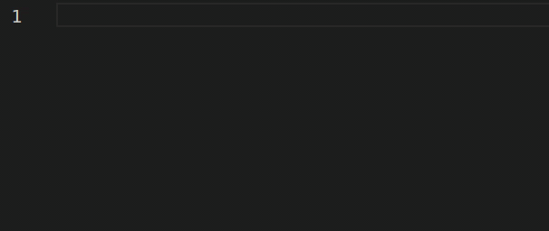

# AmbientTalk

This package introduces basic source code colouring support for the [AmbientTalk/2 language](http://soft.vub.ac.be/amop/at/introduction).

## Features

There is syntax highlight support for the basic AmbientTalk features, targetting `.at` files.

## Grammar

The [grammar used](./syntaxes/ambienttalk.tmLanguage) for the extension is generated using the [TextMate Languages](https://marketplace.visualstudio.com/items?itemName=Togusa09.tmlanguage) extension using the grammar provided in the [AmbientTalk TextMate Plugin](http://soft.vub.ac.be/amop/downloads/at2textmate.zip).

## Known Issues

The syntax highlight is not complete, features such as annotations are missing.

## Release Notes

### 1.0.0

Initial release of AmbientTalk VsCode syntax highlight support
